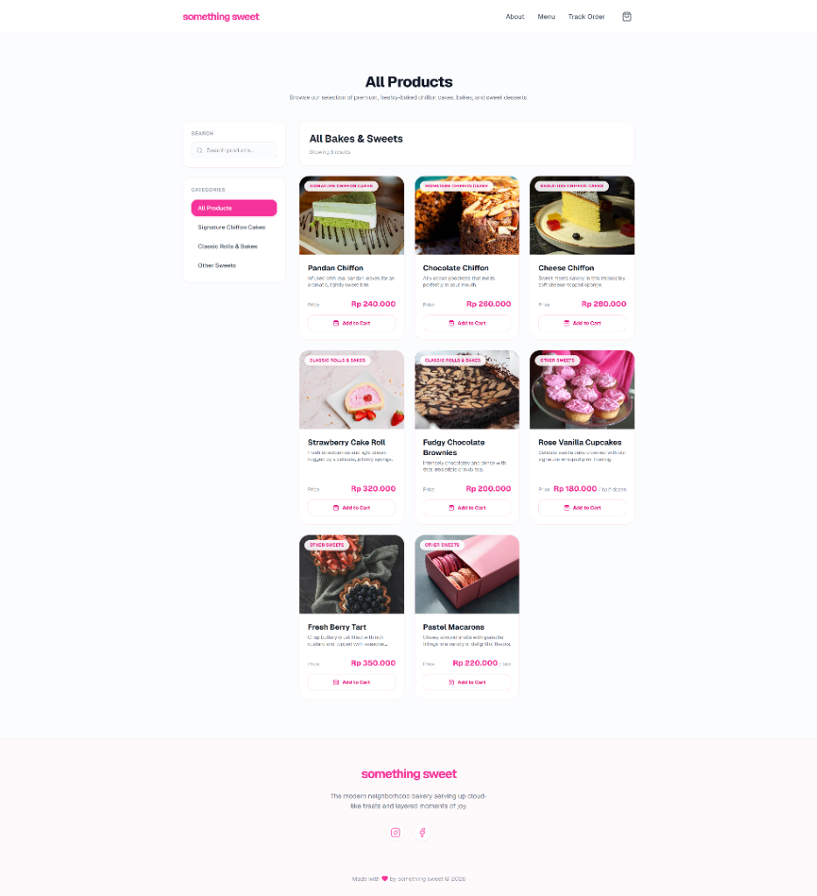
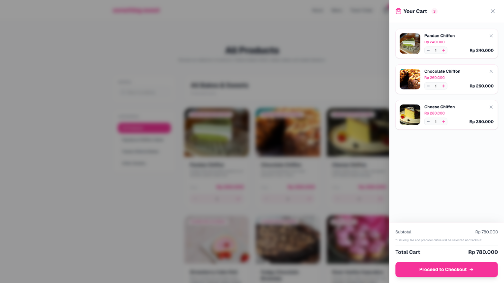
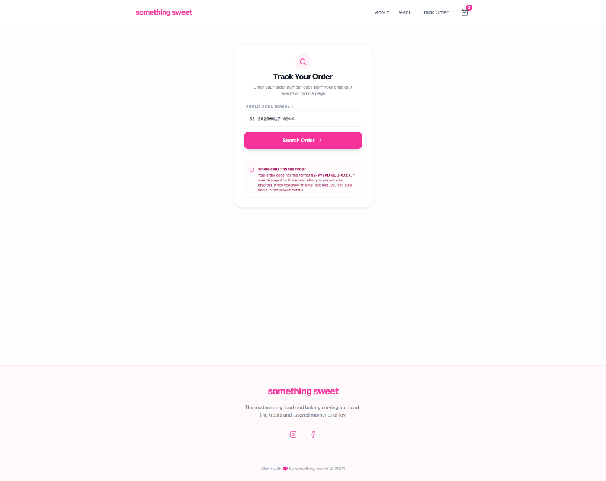
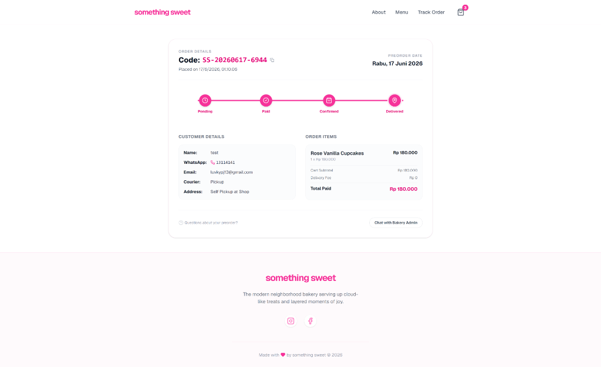

# Something Sweet 🍰

A modern neighborhood bakery web application designed for browsing premium chiffon cakes, classic rolls, and delicious pastries, placing custom preorders with flexible shipping options, and tracking order completion status in real-time.

---

## Web Screenshots

### Home Page
A warm, inviting storefront hero section featuring best sellers and quick links to browse the menu or request custom orders.

### Product Menu
Interactive menu filtering by categories (e.g., Signature Chiffon Cakes, Classic Bakes, and other sweets) with direct search capability and instant cart-adding mechanics.

### Cart Drawer
An active slide-out cart sidebar displaying selected treats, quantity adjustments, and subtotal calculations.

### Track Order Search
A clean portal to enter order codes for real-time checking of preparation status.

### Order Details & Progress Tracker
A user-facing checkout invoice with customer details, order itemizations, and a visual progress stepper (Pending → Paid → Confirmed → Delivered) for peace of mind.

---

## Tech Stack

### Frontend
- **React 19** & **Next.js 16 (App Router)** - Fast, modern, and SEO-optimized server-side rendered application architecture.
- **TypeScript** - Strict type-safety across all components and API layers.
- **Tailwind CSS v4** - Utilized for high-performance layout utility classes and fully custom components styling.
- **Radix UI Primitives** - Unstyled, accessible UI components (Dialog, ScrollArea, Select, Tabs, etc.) for a polished visual interface.
- **Lucide React** - SVG icon pack for crisp vector iconography.
- **Sonner** - Lightweight, dynamic toast notifications.
- **Date-fns** - Parsing and formatting delivery and blocked dates.

### Backend
- **Go 1.26** - High-concurrency, fast execution API engine.
- **Gin Web Framework** - Lightweight and robust HTTP web routing handler.
- **GORM** - Database Object Relational Mapping library to handle entity models and schema mappings.
- **PostgreSQL** - Relational database for storing products, categories, orders, and delivery parameters.
- **JWT (JSON Web Tokens)** - Secure stateless admin login and session authentication.
- **godotenv** - Environment variables configuration management.
- **bcrypt** - Industry standard password hashing algorithm for storing secure admin passwords.

### Infrastructure & Operations
- **Docker & Docker Compose** - Containerization of the PostgreSQL database to ensure instant development environment provisioning.

---

## Features

- **Storefront / Client-side Features:**
  - **Dynamic Home Landing:** Modern, responsive design introducing bakery options.
  - **Categorized Menu Filter:** Browse bakery items instantly by categories or search keywords.
  - **Sliding Shopping Cart:** Seamlessly update order items, adjust quantities, and calculate totals in real-time.
  - **Custom Checkout & Validation:** Integrated pickup/delivery courier selector, delivery zone pricing calculation, and calendar date validation (prevents checkout on fully-booked or holiday blocked dates).
  - **Payment Gateway Simulation:** Duitku-compatible checkout structure, with status verification and local mock payment triggers for testing.
  - **Order Tracking Stepper:** Look up invoices via unique codes (`SS-YYYYMMDD-XXXX`) to view order statuses and track progress along a timeline (Pending, Paid, Confirmed, Delivered).

- **Backoffice / Admin Features (Protected):**
  - **Secure Admin Panel:** Login portal protected by JWT validation.
  - **Product CRUD:** Manage bakery inventory, update details/prices, toggle "Best Seller" status, and upload product images.
  - **Category Management:** Categorize menus to customize customer browsing experiences.
  - **Preorder Calendar Restrictions:** Mark dates as blocked to freeze customer preorders on fully-booked slots.
  - **Delivery Zone Adjustment:** Configure courier zones and shipping fees.
  - **Order Tracker:** Track, filter, and modify order fulfillment statuses in real-time.